<p align="center">
  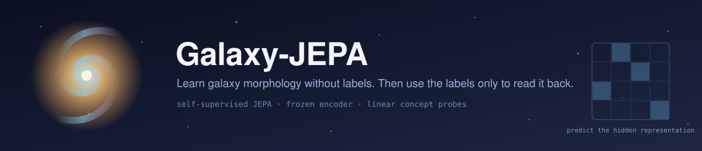
</p>

> Build a representation of galaxy images unsupervised with a JEPA, then use the Galaxy Zoo labels **only as a read-out key** &mdash; to name and test directions the representation already learned, never to train it. The labels cannot reshape the encoder's geometry; they can only *misname or blur a read-out direction*. So the experiment moves label noise out of representation-learning and into a **measurement stage** where it's inspectable and controllable &mdash; it doesn't pretend the probe is noise-free. The scientific question, per feature: is the human morphological concept a **linearly nameable direction**, an **entangled or nonlinear** one, or **absent** from the image information at this resolution?

# **About**

---

This is **v2 of my undergraduate dissertation** &mdash; a direct follow-on from [Galaxy-Zoo-Classifier](https://github.com/Ma1achy/Galaxy-Zoo-Classifier), which trained supervised CNNs and transformers to reproduce human morphological classifications and found that the models inherited the *confusion* in the crowdsourced labels. v1's finding was that the bottleneck is the *labels*, not the architecture &mdash; the models were as good as the volunteers, confusion and all. Galaxy-JEPA asks what happens if you take the labels out of the learning entirely.

A [JEPA](https://arxiv.org/abs/2301.08243) (Joint-Embedding Predictive Architecture) is trained **self-supervised** on hundreds of thousands of galaxy images: mask out patches, and have the model predict the *representation* of the hidden region from the visible context &mdash; never the pixels, and never a human label. To predict a masked galaxy region well, the model has to build an internal representation of what galaxies actually look like &mdash; their shapes, structures and features. The encoder is then **frozen**, and the Galaxy Zoo labels are brought in only as a *read-out key*, relocating the label noise out of representation-learning and into a measurement stage where it can be quantified and controlled rather than baked into the weights.

> **Status &mdash; research in progress.** The premise was proven at pilot scale (see [The First Result](#the-first-result)), the schedule problem was [resolved by measurement](#before-the-full-run), and the full-scale run has since happened: **826,968 galaxies**, stopped at 4 epochs by a pre-registered rule, **frozen-probe AUC 0.9646**. All 37 Galaxy Zoo answers have now been put through the ladder &mdash; [the catalogue](#the-catalogue) is the result, and it is not the result the design expected. The uncertainty geometry has since run too ([as a margin over untrained](#the-uncertainty-geometry-as-a-margin-over-untrained)), along with a [label-efficiency curve](#how-many-labels-does-it-take), a [coverage study of a second set of volunteers](#a-second-set-of-volunteers), and the discovery that the encoder's two largest components record [how the colour bands were cut](#what-the-two-largest-components-are), not morphology, at no cost to the readout. What remains needs rented compute: the MAE / contrastive baselines, supervised comparisons at matched label counts, and a retrain on registered bands.

# **The Problem**

---

Sky surveys have already catalogued hundreds of millions of galaxies, and the Galaxy Zoo successfully used crowdsourcing to classify their morphologies. But upcoming surveys make that approach untenable: the Legacy Survey of Space and Time (LSST) alone is expected to produce ~30 TB of imagery *per night*, for a total of ~150 PB &mdash; far more than volunteers can ever label by hand.

Self-supervised learning is the field's answer to that unlabelled deluge: learn from the images themselves, with no labels at all. v1 asked *"can a model match the volunteers?"*. v2 asks *"can we stop needing them &mdash; and use them only to read off what the images already taught the model?"*.

The deeper motivation is v1's central finding. Supervised training couples two things that should be separate: **learning what a galaxy looks like**, and **fitting the noisy votes**. Because the votes are confused on the hard questions (bulge shape, spiral winding, arm count), the model inherits that confusion &mdash; its confusion matrices mirror the volunteers'. JEPA breaks the coupling: the encoder sees only images; labels enter later, through a probe that cannot touch the encoder.

# **The Catch, Revisited**

---

v1 analysed the correlation structure of the votes before training, and found that the questions volunteers *disagreed* on were precisely the ones the models failed on.

<p align="center">
  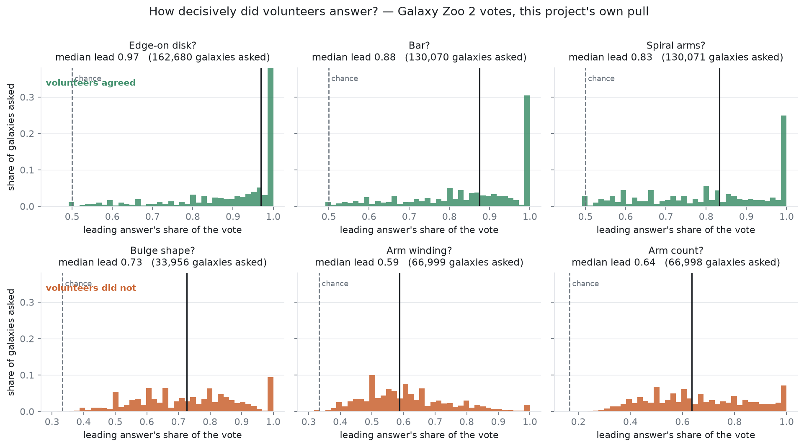
</p>

<p align="center">
  <em>The same catch, re-measured on v2's own 230k-galaxy pull rather than quoted from v1. For every galaxy that reached a question, the leading answer's share of the vote. <strong>Edge-on disk, bar and spiral arms</strong> pile up hard against 1.0 &mdash; volunteers agreed, median lead 0.97, 0.88, 0.83. <strong>Bulge shape, arm winding and arm count</strong> spread across the middle &mdash; median lead 0.73, 0.59, 0.64, with arm winding sitting closer to a coin toss than to consensus. And the tree funnels: the confused questions are also asked of a third as many galaxies. A supervised model trained on these labels can only reproduce the ambiguity.</em>
</p>

This is the problem v2 is built around. If the ambiguity lives in the *labels*, a label-free encoder shouldn't inherit it. So the question becomes: for each morphological feature, **is the human concept actually present in the image information &mdash; recoverable as a direction in a representation learned without labels &mdash; or not?**

# **The Idea: Labels as a Read-Out Key**

---

The method has two stages, and the separation between them is the whole point.

**Stage 1 &mdash; representation (label-free).** An [I-JEPA](https://arxiv.org/abs/2301.08243)-style encoder (a Vision Transformer context-encoder, an EMA target encoder, and a predictor) is trained to predict the *embeddings* of masked galaxy regions from the visible context. No pixel reconstruction, no labels, no reward. The encoder carves the latent space along whatever axes of variation actually exist in galaxy images.

**Stage 2 &mdash; measurement.** The encoder is **frozen**. The labels are consulted only now, to ask: *which of these pre-existing directions line up with what humans called a bar, a bulge, an edge-on disk?* A mislabelled galaxy can blur a read-out direction (a local, inspectable measurement error) &mdash; it **cannot** reshape the encoder's geometry the way it deformed v1's weights (a global, baked-in representation error). The noise isn't eliminated; it's *relocated* to where it can be measured and bounded.

<p align="center">
  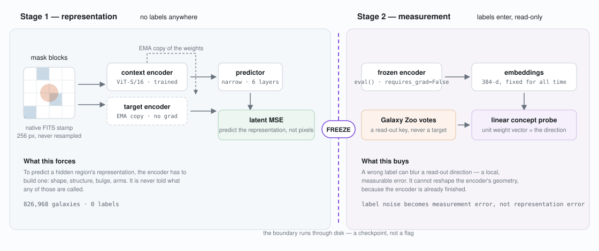
</p>

<p align="center">
  <em>The two stages, and the boundary between them. Left: masked-region embedding prediction builds the representation &mdash; labels nowhere in sight. Right: the frozen encoder is probed, with Galaxy Zoo votes used only as a read-out key. The freeze is not a flag that could be forgotten: it runs <em>through disk</em>. Pretraining writes a checkpoint, probing reads it back through <code>load_frozen_encoder</code>, and the probing package never imports the objectives package at all.</em>
</p>

# **The Nameability Ladder**

---

For any feature, *"can the labels name it?"* has four possible answers &mdash; and each is a **different scientific result**:

| Rung | Meaning |
| --- | --- |
| **1 &mdash; Clean linear direction** | A single vector whose projection tracks the feature. The concept is one coordinate of the latent space. |
| **2 &mdash; Entangled linear direction** | The axis exists but isn't independent &mdash; moving along "bar" drags "bulge". Still nameable, but tangled. |
| **3 &mdash; Nonlinear** | No single vector captures it; a controlled nonlinear probe decodes it. *Present, but not a simple direction.* |
| **4 &mdash; Not recoverable** | No probe &mdash; linear or not &mdash; finds it. The information isn't in the pixels at this resolution. |

Mapping v1's confused features onto this ladder *is the experiment*. A confused feature that comes back as a **clean direction** means the information was in the pixels all along and v1's supervised objective simply couldn't extract it cleanly. One that's **genuinely absent** means it was never a labels problem &mdash; the image doesn't contain it. Either way, the diagnosis is one v1 could not give.

The headline result chases something stronger than classification: **uncertainty geometry**. Fit a concept axis on high-consensus galaxies only (the ones volunteers overwhelmingly agreed on), then project the *ambiguous* ones the axis never saw, and ask whether their distance along the axis reproduces the human *vote fraction*. If an unsupervised geometry reproduces the volunteers' uncertainty **without ever being trained on it**, then that ambiguity is a real property of the images &mdash; flipping v1's reading that it was a labelling artefact.

# **The First Result**

---

A from-scratch JEPA was trained at **pilot scale** (10k galaxies, 6k steps, on a laptop) to answer one question before committing to anything larger: *does a label-free encoder learn useful galaxy structure at all, without collapsing?*

<p align="center">
  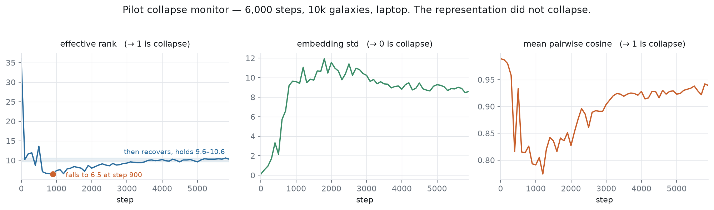
</p>

<p align="center">
  <em>The collapse monitor over 6,000 steps. Representation collapse &mdash; the standard JEPA failure &mdash; would drive embedding standard deviation to zero and mean cosine to one. Instead the representation spreads out and the early transient self-arrests. Worth reading the middle panel carefully rather than just its endpoint: effective rank <strong>falls hard to 6.5 by step 900, then recovers</strong> and holds 9.6&ndash;10.6 for the rest of the run. A shorter run that stopped at the trough would have read as collapse. The encoder learned &mdash; it did not collapse.</em>
</p>

A linear probe on the **frozen** embeddings, trained only as a read-out key, separated smooth from featured galaxies at:

> **AUC = 0.905** (95% CI 0.873&ndash;0.933) &mdash; on a label the encoder never saw during pretraining.

That headline is measured on the **high-consensus** half of the held-out set (`is_confident_extreme`: vote fraction &le; 0.2 or &ge; 0.8, 370 of 738 galaxies), so the number isn't drowned by the genuinely ambiguous middle. Stating it without that qualifier would be overclaiming, so here is the whole picture: across *all* 738 held-out galaxies the same direction scores **0.816**, and on the ambiguous middle alone &mdash; galaxies the volunteers themselves could not agree on &mdash; **0.716**.

<p align="center">
  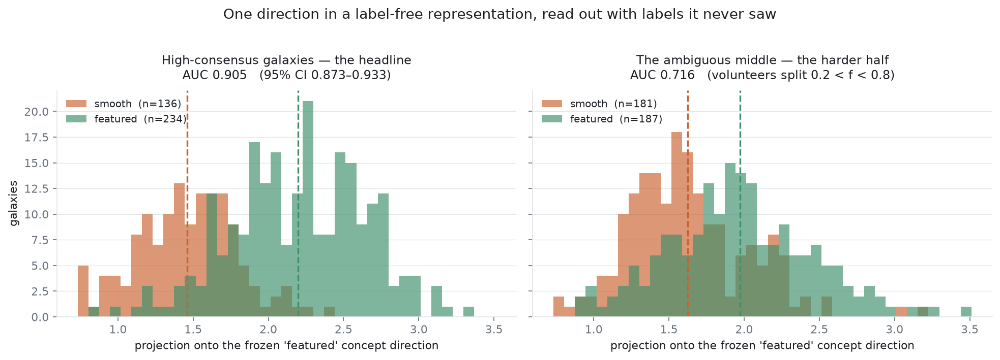
</p>

<p align="center">
  <em>The result itself rather than a 2D shadow of it. AUC is exactly the probability that a random featured galaxy sits further along the direction than a random smooth one, so the two projected distributions are the measurement. <strong>Left:</strong> the high-consensus galaxies, the headline. <strong>Right:</strong> the ambiguous middle &mdash; and the axis still ranks them at 0.716, well clear of chance, on galaxies the volunteers split on. That is the first hint of the uncertainty geometry the project is actually chasing, and it is why the ambiguous half is shown rather than dropped.</em>
</p>

This is a *signs-of-life* result, not the final science &mdash; the pilot is deliberately undertrained, on a hundredth of the corpus. But it clears the gate the whole project was staked on: a representation built without labels has a direction that human morphology can be read off. What follows is the work of earning that result at full scale.

# **Before the Full Run**

---

The pilot cleared the gate, so the next step is the full-scale run &mdash; 826,968 galaxies, 50,000 steps, roughly **12 hours** on the same laptop. Before spending that, one thing needed explaining. A smoke run on the full corpus showed effective rank falling from 22.6 to 4.1 within 175 steps and staying there, where the pilot had held around 10.3. Low rank is the collapse diagnostic, so this was worth understanding *before* the run, not after it.

The suspect was the schedule. The reference recipe ([I-JEPA](https://arxiv.org/abs/2301.08243)) peaks at a learning rate of 1e-3 **at batch 2048**; this project runs 1e-3 at **batch 32**. Square-root scaling &mdash; the conventional rule for Adam-family optimisers &mdash; puts the equivalent near 1.25e-4, so the configured rate sits about **8&times; above** it, and with warmup-only and no decay it stays there for the whole run.

So: six short runs, identical seed, identical data order, identical masks, identical EMA. Only the learning-rate schedule differs.

<p align="center">
  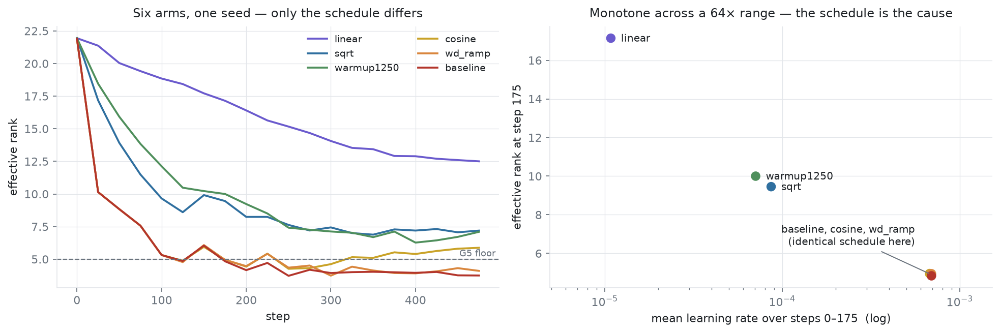
</p>

<p align="center">
  <em>Left: all six arms from one seed. Right: mean learning rate over the window where the fall happens, against the rank at its end.</em>
</p>

The answer was yes, on four independent grounds:

- **Monotone dose&ndash;response across a 64&times; range** of early learning rate.
- **Replicated by two different mechanisms.** One arm lowers the peak; another keeps the same 1e-3 peak and merely takes 1,250 steps to reach it. Matched early learning rate, matched rank &mdash; so it is the *magnitude early*, not how it was produced.
- **The comparison is controlled to bit-identity.** Two arms share a schedule for their first 100 steps and their effective ranks agree to four decimal places there, diverging only once the schedules do.
- **Embedding scale inverts the rank ordering exactly**, across all six arms. Which also says the failure mode is not the textbook one: the embeddings are not shrinking towards a point, they are *growing* in magnitude while concentrating into fewer directions.

The trap here is obvious and worth naming: the arm with the **highest** effective rank has by far the **worst** loss &mdash; it holds rank by barely having started. It is the arm being rejected. Effective rank is a collapse diagnostic, not the objective, and an arm that holds rank while learning nothing is worse than the baseline.

What that could *not* settle is which schedule is better. Effective rank is a collapse diagnostic, not the objective &mdash; and the arm with the **highest** rank of the six had by far the **worst** loss, holding rank by barely having started. So the question went to a longer run that ends in the actual objective: two arms at 3,000 steps, a decision rule written down and committed *before* either was launched, then both frozen encoders probed on the same held-out galaxies.

<p align="center">
  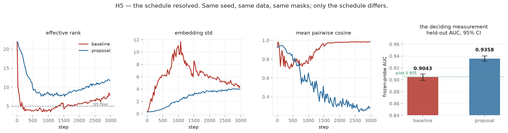
</p>

<p align="center">
  <em>The resolving run. Same seed, same data order, same masks; only the schedule differs. The fourth panel is the one that decides.</em>
</p>

The scaled recipe wins, and the intervals do not overlap: **AUC 0.9358** (95% CI 0.9315&ndash;0.9402) against **0.9043** (0.8988&ndash;0.9097) on the same 34,829 held-out galaxies. It wins on the full held-out set too (0.8420 vs 0.8084) and on the ambiguous middle (0.6624 vs 0.6358). It is now the recipe: [D17](DECISIONS.md).

**The interesting part is that the loss said the opposite.** The old recipe was **19&times; better on loss** &mdash; 0.0164 against 0.3168 &mdash; and lost the objective decisively. Look at the third panel for why: its mean pairwise cosine ends at **+0.984**, embeddings 98% aligned. Latent MSE is measured against a moving EMA target, so a predictor and target that co-adapt onto a shared mean component score beautifully while encoding almost nothing. **A low loss here is a collapse signature, not a score.** Anyone selecting on it would have kept the worse recipe &mdash; which is the whole argument for ending the experiment at a probe rather than at a training curve.

It also falsified this project's own pre-registered kill criterion. The old collapse floor would have halted the *baseline* run &mdash; it sat below the threshold for 53 consecutive readings and then went on to score 0.9043. The floor has been [re-derived](DECISIONS.md), with the honest note that its new value has weaker grounding than the one it replaces: every trace here that dipped low still worked, so the evidence cannot yet say where a genuinely dead run sits.

This is what most of the engineering in this repository is for: making that kind of question cheap to ask, hard to fudge, and impossible to quietly get wrong.

# **The Catalogue**

---

The full-scale run went out at 826,968 galaxies with the schedule the last section settled, and stopped itself at **4 epochs** &mdash; 101,308 of a budgeted 253,270 steps &mdash; when the pre-registered rule saw the AUC gains flatten (+0.0010, then +0.0005). Roughly 28 hours of budget handed back by a rule written before launch. The frozen encoder reads the smooth/featured split at **AUC 0.9646** on 34,829 held-out galaxies, with a range of [0.9609, 0.9646] across two independent training draws with the splits held fixed.

Then the actual experiment: every one of the **37 Galaxy Zoo answers** put through the nameability ladder on that frozen encoder, with matched evaluation on every feature, and each one measured not against chance but against **its own untrained-encoder bar** &mdash; the AUC an identical architecture with random weights achieves on that same question, averaged over 30 seeds.

<p align="center">
  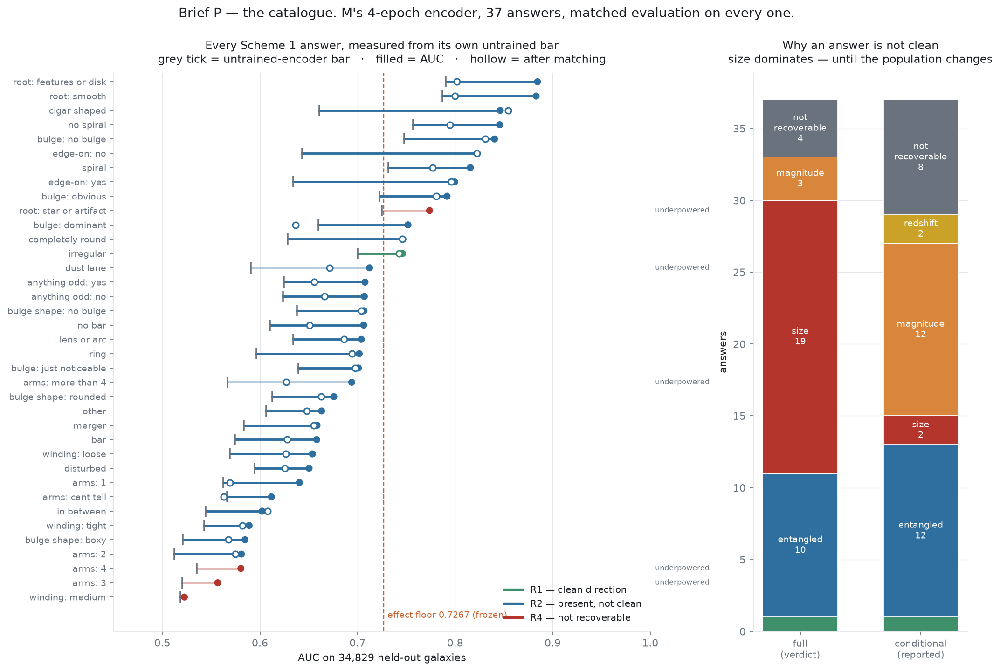
</p>

<p align="center">
  <em>Left: every answer as a segment from its untrained bar (grey tick) to the achieved AUC (filled), with the AUC after matching on nuisance variables as a hollow ring. The segment <strong>is</strong> the effect; the distance from zero is not. Right: why the answers that aren't clean aren't clean.</em>
</p>

**The headline is not the one the design expected.** Thirty-three of thirty-seven answers clear their own untrained bar &mdash; the representation contains the tree. But exactly **one** is a clean, independent direction. Everything else that exists is entangled with other concepts or loses its effect when a nuisance variable is held fixed. The standing question was *"is a human concept a direction in the representation?"*, and the catalogue's answer is: it is a direction &mdash; almost never an independent one.

**And the nuisance, once measured properly, is not doing the damage.** An earlier version of this section said nineteen answers "lose their effect when apparent size is matched". That was the gate's arithmetic. The ladder counted an answer as surviving matching only if its matched AUC cleared the 0.7267 effect floor, and 21 of the 22 "confounded" answers were already below that floor *before* matching. Re-judged by whether the margin over the untrained bar survives, measured on the same matched galaxies with the bar re-measured there, **none** of those 22 loses its effect to size, magnitude or redshift. The median margin retained is 1.00. The one answer that does collapse under matching is *winding: medium*, which sits at AUC 0.52 and barely clears its own bar to begin with. What keeps most answers off R1 is effect size, not a nuisance: they are present, but below the floor.

Notice also the first thing the left panel shows, before any verdict: the grey ticks are nowhere near 0.5. An **untrained** ViT reads the smooth-or-featured split at AUC 0.79 with random weights, purely from image statistics. Measuring "existence" against chance would have credited the encoder for that. Measuring it against the architecture's own untrained bar does not.

## What the corpus can and cannot resolve

A verdict of "not recoverable" is only a scientific claim if the measurement could have found the thing. So every rung carries a **resolvable margin** &mdash; the smallest effect over that feature's own bar that this many galaxies could have demonstrated &mdash; and where the margin is too wide, the verdict reads *"cannot resolve at this N"*, never *"absent"*.

<p align="center">
  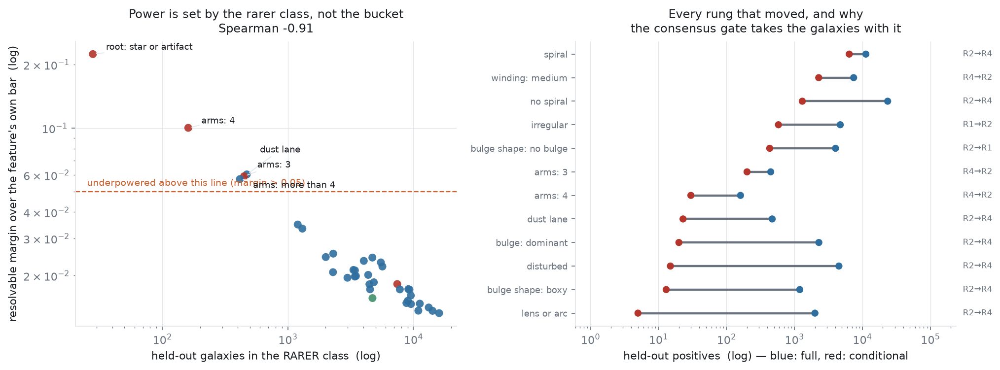
</p>

<p align="center">
  <em>Left: power is set by whichever class is scarce, not by the headline bucket size. Right: every answer whose rung changed when the population was restricted to majority-route galaxies, with the held-out positives that survived the restriction.</em>
</p>

The case this rule exists for is `star or artifact`. Its AUC of 0.774 sits *above* its untrained bar of 0.725 and would read as a finding &mdash; but on **28 positives in 34,829 galaxies**, nothing it could have produced would have survived multiplicity correction. It is reported as unresolvable, not as a result.

The right panel is the other half of the same lesson. The experiment runs both populations &mdash; all galaxies that reached a question, and only those whose parent question reached a majority. The second was expected to say *where* a signal lives. On this corpus it mostly says how few galaxies survive a majority gate: `lens or arc` goes from 2,004 held-out positives to **five**. Where a rung improves, it improves as the sample collapses. That is why the headline verdicts are read from the full population, which is gated only by a frozen parameter.

## Does the geometry look like human judgement?

The encoder never saw a vote. So the concept directions it produced can be laid against the structure of human voting on **the same galaxies** &mdash; same objects, same votes, only the representation differs.

<p align="center">
  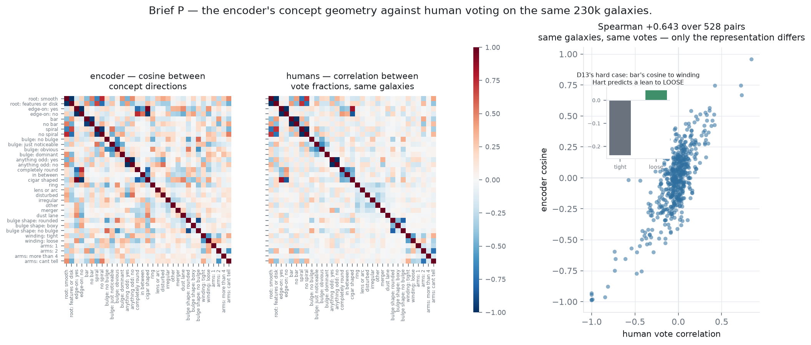
</p>

<p align="center">
  <em>The encoder's concept geometry (left), the humans' vote structure on the same galaxies (centre), and the two laid against each other (right). Inset: D13's hard case.</em>
</p>

**Spearman +0.643 over 528 answer pairs.** The structure a label-free encoder builds substantially tracks the structure of human voting, without ever having been shown a vote. The disagreements are the interesting part &mdash; pairs the encoder ties that the voters separate are candidates for the size axis above; pairs the encoder separates that the voters tie may be the encoder doing better than the labels, since vote correlation carries the volunteers' own confusions.

The inset is a specific, falsifiable prediction. Bars and spiral arms co-occur, and the worry is that a representation merely learns "confidently classified galaxy" and reads every morphological answer off that one axis. But Hart et al. measured that arms in strongly barred galaxies are roughly **4&ndash;6&deg; looser** than in unbarred ones. So a bar direction tracking *physics* should lean towards loose winding specifically; one tracking classification confidence should lean towards every spiral answer about equally. The measured cosines are **+0.042 to loose and &minus;0.239 to tight**. *Restated (Brief U0):* that is less than it first looked. Neither pair cleared the 0.30 cut that sends a pair to adjudication, and +0.042 is inside the noise of two random directions in 384 dimensions (sd &asymp; 0.05). What stands is a weak anti-alignment with tight winding, the sign Hart et al. predict. It is an observation, not a resolution of the hard case, which Brief U1 takes up against the same-corpus votes.

As a continuity check, two of the three correlations quoted from v1 come back at the same sign and comparable magnitude through a different dataset and a different representation: edge-on &times; cigar-shaped +0.83 &rarr; **+0.957**, bar &times; 2-arms +0.56 &rarr; **+0.419**.

The full write-up, including the limitations that travel with every verdict, is in [`artifacts/p_findings.md`](artifacts/p_findings.md).

## The uncertainty geometry, as a margin over untrained

The headline test ran in Brief U2, pre-registered and hashed. The axis is fitted on each answer's consensus extremes only. The ambiguous middle, which the axis never sees, is projected onto it and ranked against the vote fraction. **All 27 answers with a linear direction track the volunteers' split**, and every one does better than all three untrained encoders.

That is not the whole story. Untrained encoders already reach &rho; = +0.32 on smooth, so much of "reproduces human uncertainty without seeing a vote" is the architecture. Stated the way existence is stated, as trained minus the untrained range, the learned part is **+0.04 to +0.23**. Smooth/features gains +0.12 to +0.16, and bulge answers gain up to +0.2.

Off the axis, the more ambiguous galaxies sit further along the concept path's bend. For 13 answers this survives controlling faintness, SNR, size and redshift. Read by magnitude rather than significance:

- **Spiral is mostly visibility.** The control removes 70&ndash;80% of its effect, though untrained encoders bend the other way.
- **Merger's association reverses under control.** It still reverses against a single visibility index, and untrained encoders carry more of it than M does.
- **Bulge "obvious" was suppression.** Its reversal came from entering four correlated covariates together, and it disappears against a single visibility index.

Details and every margin are in `artifacts/u_findings.md` and `artifacts/v_findings.md`.

The graded questions were tested too (Scheme 2, D26). Each asks whether the answer categories land in order along an axis fitted only on the two extremes. All four do. An ordered axis can still be a visibility gradient, though, so each is checked against a measurement made without votes:

- **Roundness** tracks measured axis ratio.
- **Bulge prominence** tracks a photometric bulge-to-total decomposition, in both directions: the encoder carries the measurement beyond the votes, and the votes beyond the measurement. The first version of that test could not tell this from two noisy copies of one quantity; re-run with the corrected design (Brief Z3), it holds with wide margins. The cleaner half is the measurement side: M carries photometric bulge fraction the votes do not, +0.15 over untrained.
- **Winding** is ordered, and the volunteers' ordering survives visibility against machine-measured pitch angle (SpArcFiRe, in two samples). The encoder's own winding axis is weaker: it meets measured pitch mostly through visibility, and its learned part sits on the votes, not the measurement. And pitch is not a settled reference: on the 34 galaxies both public catalogues measure, SpArcFiRe and 2DFFT pitch do not agree (&rho; &minus;0.25, upper bound +0.10). The claim stands within one algorithm family and no further.
- **Arm count** is ordered largely because visibility falls from "1 arm" to "4+". It is not established as morphology.

## How many labels does it take?

A frozen representation is only useful if it can be read with few labels. So every answer's probe was retrained on 100 to 40,000 labelled galaxies (five stratified draws per size, always scored on the same 34,829 held-out galaxies), on M and on three untrained encoders (Brief AA1).

<p align="center">
  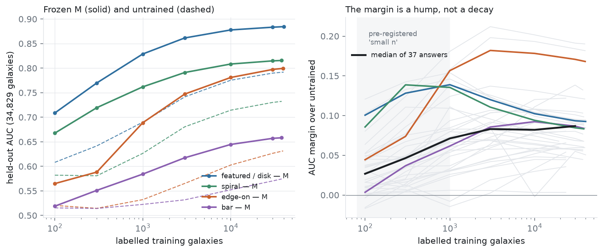
</p>

<p align="center">
  <em>Left: four answers on M (solid) and untrained (dashed). Right: M's margin over untrained for all 37, with the median in black. The prediction was that the margin is largest in the shaded region.</em>
</p>

**The pre-registered prediction failed.** It said the margin over untrained would be largest at small n. For 24 of 37 answers it is largest at large n, 9 are flat, and only 4 peak small: smooth, featured, spiral and no-spiral, the concepts M reads best. The margin is a hump, not a decay. At 100 labels M barely beats a random ViT on most answers (median +0.03). It needs a few hundred labels before its structure shows, and its advantage peaks between 1,000 and 10,000 labels, the size of a small labelling campaign.

Read as a classifier, M reaches 90% of its full-data AUC (above chance) with about 10,000 labels on most answers, and 95% with about 30,000. Smooth/featured goes 0.71 &rarr; 0.83 &rarr; 0.88 at 100, 1,000 and 10,000 labels. Winding and arm count stay near chance at every n. This is label efficiency against an untrained encoder only. Whether it beats a supervised ViT or a fine-tuned M at the same n is the rental's question.

## A second set of volunteers

Galaxy Zoo DECaLS asked many of the same questions about the same galaxies, on deeper imaging. That makes it a possible referee: where SDSS volunteers were unsure and DECaLS volunteers were sure, whom does the encoder side with? Brief AA2 measured whether that test is possible before running it. Volunteer votes only, never the Zoobot predictions.

<p align="center">
  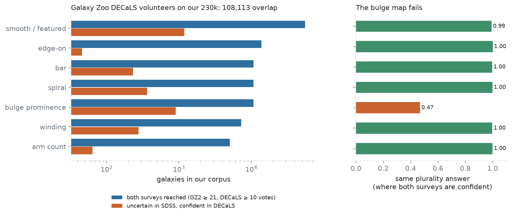
</p>

- **Overlap: 108,113 of our 230,359 galaxies** (crossmatch within 3″; median separation 0.12″; chance matches 0.06%).
- **The questions map, except bulge.** Where both campaigns are confident, their plurality answers agree 99&ndash;100% on smooth, edge-on, bar, spiral, winding and arm count. On bulge prominence they agree 47% of the time: the two trees draw the answer boundaries in different places, so DECaLS cannot referee bulge under a simple map.
- **The referee test as specified is not possible.** Galaxies SDSS voters doubted and DECaLS voters settled are almost all resolved the same way by the deeper image, as featured or as having arms (smooth 178 : 6 in the test split). An AUC with six negatives measures nothing. A paired sign test on about 1,000 such galaxies would have 88% power, which is the next brief's.
- **Two other uses are powered.** DECaLS winding on 1,105 held-out galaxies can referee the encoder's winding axis (smallest detectable &rho; 0.08), and the imaging-depth comparison is powered on every question, with no new images needed.

## What the two largest components are

The encoder's two largest principal components hold 37% of its variance, and every earlier brief failed to name them. They were learned (untrained encoders don't have them), they were not morphology, and they behaved like the x and y parts of an arrow drawn on the image: rotating the stamp by 90&deg; swapped them, and mirroring flipped one. But they didn't move when the whole stamp moved.

<p align="center">
  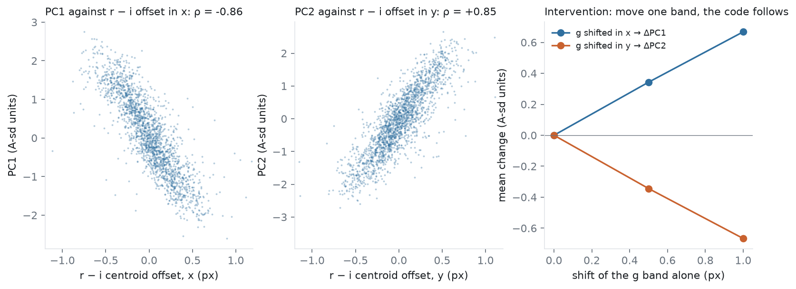
</p>

<p align="center">
  <em>Left and centre: the two components against the measured offset between the r- and i-band images of each galaxy. Right: shifting only the g band by half a pixel and one pixel moves them in a straight line.</em>
</p>

**They record how the colour bands line up.** Each stamp is three images, g, r and i, cut separately from three CCDs. The offsets between the bands' centroids predict the two components at R² 0.83 and 0.84, and nothing else measured adds to that (Brief AA3a). The intervention settles it: shift the g band alone and the components move by the predicted amount, linearly, on the paired axis only. The misregistration comes from the cutout itself, which [The Data Layer](#the-data-layer) describes.

**Does it cost the morphology anything?** Averaging each galaxy's embedding over the eight flips and rotations removes the code (its variance falls to 2&ndash;3%), and 33 of 37 answers then read better, by +0.01 to +0.05 AUC (Brief AA3b; pre-registered state MIXED, because six salience verdicts moved each way). But averaging eight views is also test-time augmentation. An exploratory check separates the two:

<p align="center">
  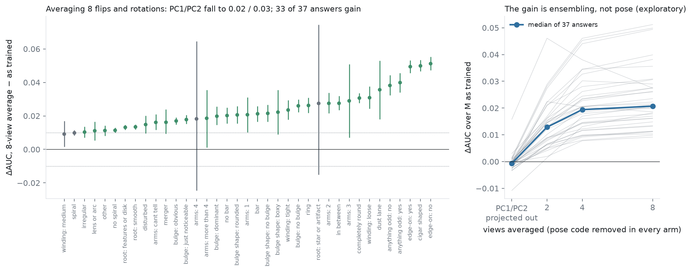
</p>

<p align="center">
  <em>Left: every answer after averaging 8 views, with its bootstrap interval. Right: the pose code is removed in every arm; only the number of views changes.</em>
</p>

Projecting the two components out of the embedding directly removes the code completely and changes nothing: median &Delta;AUC &minus;0.0007, no answer improved. The gain grows with the number of views averaged while the pose code is equally gone in every arm. **The pose code is harmless to the linear readout; the gain is ensembling.** That gain is available to any encoder, including the baselines, so it can only enter a comparison if every encoder gets it. Winding reads the same either way: mostly visibility.

# **The Data Layer**

---

A self-supervised model trained to predict masked regions will happily learn *any* structure in its inputs &mdash; including artefacts. So the fidelity of the imagery matters more here than it did for a supervised classifier, and a substantial part of this project is a data pipeline built to not lie to the encoder.

**Native FITS, not display JPGs.** v1 used 8-bit display-stretched cutouts; those irreversibly compress the low-surface-brightness range where the confused features (winding, arm count, tidal structure) live. Probing on them would confound *"absent from the pixels"* with *"destroyed by the 8-bit quantisation"*. v2 pulls raw FITS frames and applies a single, stamped `asinh` stretch.

**No rebinning &mdash; an empirically proven choice.** A fast cutout service was tested as a shortcut and **rejected** by a fidelity test: it preserved calibrated flux and bright signal, but attenuated high-frequency power to ~11% of native and correlated the pixel noise &mdash; injecting learnable fake structure exactly in the faint regime the science depends on. Native-resolution frames, never resampled, are therefore a *measured* protection, not a preference.

**Server-side cutouts at native fidelity.** Direct frame download is throttled to the point of infeasibility at corpus scale, so cutouts are made *next to the data* on [SciServer Compute](https://www.sciserver.org/) &mdash; only ~50 KB stamps cross the link, byte-identical to the native frame, at ~17&times; the throughput.

**A cost of not rebinning, found afterwards.** SDSS images each band on its own CCD, on its own pixel grid. The cutout cuts each band against that band's own coordinates and, by design, never resamples, so each band's stamp lands on the nearest whole pixel independently: g, r and i sit up to &plusmn;0.5 px apart, differently for every galaxy. The encoder noticed. Its two largest components, 37% of its variance, read that sub-pixel misregistration (Brief AA3a; R² 0.83 from the measured band offsets, and shifting the g band alone by one pixel moves them by exactly the predicted amount). It turns out not to cost the linear readout anything ([see above](#what-the-two-largest-components-are)), but 37% of the variance spent on a cutout artefact is capacity not spent on galaxies. A retrain should register the bands with a Fourier sub-pixel shift, which keeps all power below Nyquist. That changes a frozen data invariant, so it needs a decision entry first.

**Leak-impossible splits.** The pretraining and probing corpora are deduplicated by object ID so the frozen encoder can never have seen a probe-test galaxy during pretraining; the uncertainty-geometry firewall (consensus galaxies fit the axis, ambiguous galaxies test it) is enforced *in code*, not by discipline. These guarantees are merge-blocking invariants &mdash; a split that could leak cannot be committed.

# **Architecture**

---

The codebase is built around a few structural commitments, several inherited as design DNA from a separate orchestration project:

- **The encoder is just an `nn.Module` behind a Protocol.** JEPA, and the planned MAE / contrastive baselines, all satisfy the same interface, so the probing ladder stays identical across objectives &mdash; the baseline comparison can't become mush.
- **Gates as first-class acceptance criteria.** "The run succeeded" and "the scientific claim passed its controls" are separated: a failed nuisance-control is a *finding*, not a broken run.
- **Provenance everywhere.** Every run is config-hash + git-SHA stamped; the preprocessing stretch and split assignment are part of the experiment record, not notebook constants.
- **Fail loud, never silently corrupt.** Schema assumptions are tested at small scale before any large pull; metrics are anchored so they can't quietly return a meaningless number.

# **What's Next**

---

The full experimental design of the probing stage is architected and largely built: the nameability ladder, a controls battery that gates every rung verdict (selectivity, negative controls, a nuisance battery), the uncertainty-geometry measurement, and MAE / contrastive baselines run through the same ladder to separate *intrinsic to the images* from *artefact of the objective*.

The schedule is settled, the full-scale run is done and [the catalogue](#the-catalogue) is in. The **uncertainty geometry** is in too: it tracks on every answer, by a margin over untrained encoders that is real but modest. The local measurements have now decided what the rented compute is for:

- **MAE / contrastive baselines.** Without them the catalogue is what *one* objective can say and no more. The one-clean-direction finding in particular needs a baseline to interpret: whether it is a fact about JEPA or a fact about galaxy images is exactly the question a second objective answers.
- **Supervised and fine-tuned comparisons at matched label counts.** The label-efficiency curve is measured against an untrained encoder only; "label-efficient" as a practical claim needs a supervised ViT and a fine-tuned M at the same n.
- **A retrain on registered bands, as hygiene.** The encoder spends its two largest components on a cutout artefact. Removing it after the fact changes no linear readout, so this is not expected to move the catalogue; registering g and i onto r's grid removes it at the source for the baselines and any retrain. It changes a frozen data invariant and is recorded as needing a decision first.
- **The DECaLS tests that are powered locally**: winding refereed by a second set of volunteers, the imaging-depth comparison, and a paired sign test for whether the encoder sides with the deeper image where SDSS voters were unsure.

# **Dependencies**

---

The quickest way in is the included **dev container** (`.devcontainer/`) &mdash; open the repo in VS Code or a Codespace and *Reopen in Container*, and it builds a Python environment with [uv](https://docs.astral.sh/uv/) and installs the project.

To set it up locally instead:

```
uv sync --extra dev --extra data --extra eval
```

The stack is PyTorch for the model (with [Apple MPS](https://developer.apple.com/metal/pytorch/) support on Apple Silicon, CUDA elsewhere), `astropy` / `astroquery` for the FITS imagery and the SDSS / Galaxy Zoo catalogue joins, and the usual scientific Python tooling (NumPy, scikit-learn, UMAP, Matplotlib) for the probing and figures. The optional extras gate the heavier dependencies: `data` for the imagery pull, `eval` for the probing stack.

> The Galaxy Zoo morphology labels are the [Galaxy Zoo 2](https://data.galaxyzoo.org/) vote fractions; the imagery is pulled as native SDSS frames via SciServer.

# **Usage**

---

**Obtaining the data.** Imagery is pulled as native FITS frames from the SDSS Science Archive Server via [SciServer Compute](https://www.sciserver.org/) (which requires a free token), with the Galaxy Zoo 2 vote fractions joined from the SDSS catalogue. The pull is staged &mdash; a small slice for development, scaling to the full corpus.

**Pretraining** trains the label-free JEPA encoder and writes a provenance-stamped, frozen checkpoint, with the collapse monitor logging the health of the representation throughout.

**Probing** reloads the frozen encoder and fits the read-out probes &mdash; the per-feature ladder, the controls, and the uncertainty geometry &mdash; emitting the headline figures.

# **Repository**

---

| Path | Contents |
| --- | --- |
| `src/galaxy_jepa/core/` | The encoder Protocol, config + provenance, and the Gate machinery |
| `src/galaxy_jepa/data/` | The FITS pull, `asinh` pipeline, masking boxes, and the leak-impossible split guards |
| `src/galaxy_jepa/models/` | The Vision Transformer encoder |
| `src/galaxy_jepa/objectives/` | The JEPA objective and training loop |
| `src/galaxy_jepa/probing/` | The frozen read-out probes |
| `src/galaxy_jepa/harness.py` | The reusable train &rarr; freeze &rarr; probe &rarr; figures entrypoint |
| `docs/galaxy-jepa-spec.pdf` | Consolidated design spec (science + paper skeleton) &mdash; the reconciled design source of truth |
| `docs/spec/` | Specifications for the encoder, config, gates, data, splits and validation |
| `artifacts/` | Networked, credential-touching pull glue and measurement scripts (kept out of the importable package) |
| `assets/` | README figures, regenerated from real run artefacts by `artifacts/readme_figures.py` |
| `.devcontainer/` | Dev container (uv-based) |

# **Help**

---

**Why train without labels at all &mdash; isn't that throwing away information?**

The labels aren't thrown away; they're *moved*. v1 showed that training on the noisy votes bakes their confusion into the model. Here the labels are used only to *measure* the label-free representation, so their noise becomes a measurement error you can quantify and control &mdash; not a representation error baked into the weights. See [The Idea](#the-idea-labels-as-a-read-out-key).

**What does the JEPA actually predict, if not pixels?**

The *representation* of the masked region &mdash; an abstract feature vector &mdash; not the pixels themselves. This is the key difference from a masked autoencoder, and it's why the encoder learns semantic structure rather than wasting capacity reconstructing noise. It's what the "Predictive" in Joint-Embedding *Predictive* Architecture refers to.

**Why is the imagery pulled as FITS instead of the JPGs v1 used?**

Display JPGs compress exactly the faint-structure range the hard morphological features live in. Probing on them couldn't distinguish *"the feature isn't in the pixels"* from *"the JPG destroyed it"*. See [The Data Layer](#the-data-layer).

**Is this finished?**

No &mdash; it's research in progress. The premise is proven at pilot scale, the full-scale run is done, and all 37 answers have been through the ladder, the uncertainty geometry and a label-efficiency curve. What's missing is the comparison that makes it interpretable: the baselines, and a retrain on registered bands. See [What's Next](#whats-next).